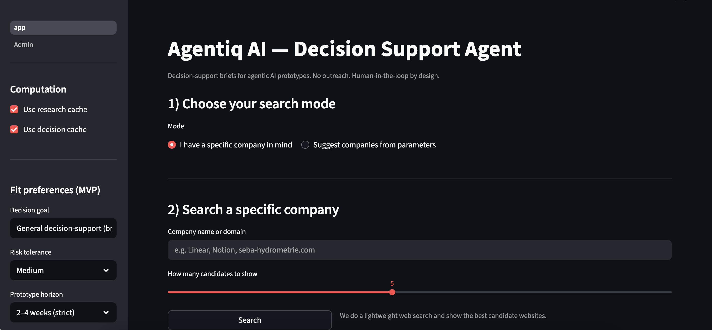

▶ **Watch the 90s demo video:** [AgenticAI_Video.mov](https://youtu.be/N8R9q86Su5A)


# Agentiq AI — Decision Support Agent (Demo)

**Agentiq AI** is an agentic decision-support prototype for defining, constraining, and evaluating AI-driven decisions in complex, high-risk, or poorly specified domains.

The focus is **not automation**, but **decision governance**:

- Structured research  
- Explainable evaluation  
- Explicit trade-offs  
- Human-in-the-loop decision support  

---

## Why This Project Exists

As agentic AI systems move into regulated and high-stakes environments, the core challenge is no longer model capability, but **decision quality and accountability**:

- Which use cases are realistically feasible?
- Where is a sensible MVP boundary?
- What risks and uncertainties exist early on?
- Which questions must be answered before execution?

Agentiq AI explores how these questions can be addressed through a **clear, reproducible decision-support brief**, rather than ad-hoc judgments or hidden heuristics.

---

## What This Demo Does

The system guides an operator through a structured decision flow and produces a **human-readable decision-support brief**.

The output is designed to be:

- Explainable  
- Comparable  
- Auditable  
- Suitable for human review and approval  

---

## Core Decision Flow

### Step 1 — Intent Selection
- Analyze a specific company **or**
- Discover companies based on domain parameters

### Step 2 — Input & Research
- Company name / domain **or**
- Industry, keywords, region

### Step 3 — Candidate Selection
- Overview of relevant companies
- Early-fit indicators (not final decisions)

### Step 4 — Decision-Support Brief
- Structured, human-readable output
- No raw JSON or debug artifacts in the default view

---

## Company Profile (Research Output)

For each company, the system generates a grounded profile including:

- Confidence score (research certainty)
- Positioning & offering
- Product and scope indicators
- Likely user roles
- Potential decision-support opportunities
- Uncertainties and knowledge gaps
- Transparent source references

The UI intentionally avoids exposing raw model outputs.  
All content is presented as structured text for human evaluation.

---

## Decision-Support Result

Based on the company profile, the system produces:

- Suitability score for decision-support / agentic use cases
- Concise reasoning summary
- Concrete MVP or prototype suggestion
- Why it could work
- Risks and counterarguments
- Open questions for next steps

All recommendations are **explainable and contestable**, not final.

---

## UI & UX Principles

This demo intentionally focuses on an **internal / admin-style interface** rather than a consumer-facing UI.

**Design principles:**

- Decision control over visual polish
- Clear separation of steps and mental contexts
- Explicit parameters (goal, risk tolerance, horizon)
- No hidden automation
- No black-box outputs

UI polish is secondary to clarity, structure, and governance.

---

##  High-Level Architecture

```text
demo.py
|
+-- UI / State Management (Streamlit)
|   +-- Step-based decision flow
|   +-- Navigation & context separation
|   `-- Minimal, functional styling
|
+-- Research layer
|   `-- build_company_profile()
|
+-- Discovery layer
|   `-- discover_companies()
|
+-- Fit & scoring layer
|   `-- score_company_fit()
|
`-- Session cache
    +-- profiles_by_name
    `-- fit_by_name
```

---

## Key Design Decisions

### Agentic, Not Form-Driven
The system answers questions instead of collecting inputs.

### Explainability First
Every score comes with reasoning, uncertainty, and context.

### Stepwise Progression
Each screen represents a single decision context.

### Human-Readable Outputs
No JSON or debug views in the default flow.

---

## Tech Stack (High Level)

- Python  
- Streamlit (UI & state management)  
- Pandas (data handling)  
- Custom research & scoring modules  
- CSS (minimal internal-tool styling)

---

## Scope & Limitations

This is a **prototype**, not a production system.

**Intentionally out of scope:**

- Persistent storage
- Multi-user authentication
- Compliance guarantees
- Production-grade scoring models

The goal is to demonstrate how decision-support for agentic systems can be structured—not to ship a finished product.

---

## What I Would Improve Next

- Formalized decision criteria schemas
- Clear separation between research and decision layers
- Human-in-the-loop approval checkpoints
- Decision versioning & audit trail
- Exportable decision memos (PDF / Markdown)

---

## Target Audience

- Product & innovation teams  
- Strategy and corporate innovation  
- AI consultants  
- Venture studios  
- Founders in early validation phases  

---

## License & Usage

Internal prototype / demo only.  
Not intended for production use without further validation and safeguards.